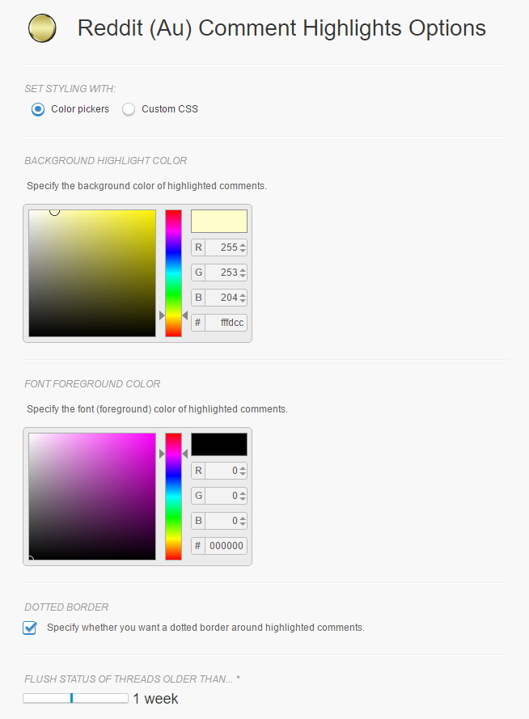

A browser extension that highlights unread comments on [Reddit](https://www.reddit.com) since your last visit. A feature normally reserved to Reddit gold users!

[![Chrome Web Store][chrome-web-store-image]][chrome-web-store-url]
[![Mozilla Add-on][mozilla-addon-image]][mozilla-addon-url]
[![Build Status][github-actions-image]][github-actions-url]
[![Quality Status][code-climate-image]][code-climate-url]
[![Coverage Status][codecov-image]][codecov-url]
[![License][license-image]][license-url]

[chrome-web-store-image]: https://img.shields.io/chrome-web-store/v/jeodebnjeecpbmbgimbpinccfkihhjid.svg?style=flat-square
[chrome-web-store-url]: https://chrome.google.com/webstore/detail/jeodebnjeecpbmbgimbpinccfkihhjid

[mozilla-addon-image]: https://img.shields.io/amo/v/reddit-comment-highlights?style=flat-square
[mozilla-addon-url]: https://addons.mozilla.org/firefox/addon/reddit-comment-highlights/

[github-actions-image]: https://img.shields.io/github/workflow/status/aesy/reddit-comment-highlights/Continous%20Integration?style=flat-square
[github-actions-url]: https://github.com/aesy/reddit-comment-highlights/actions

[code-climate-image]: https://img.shields.io/codeclimate/maintainability-percentage/aesy/reddit-comment-highlights?style=flat-square
[code-climate-url]: https://codeclimate.com/github/aesy/reddit-comment-highlights

[codecov-image]: https://img.shields.io/codecov/c/github/aesy/reddit-comment-highlights?style=flat-square
[codecov-url]: https://codecov.io/github/aesy/reddit-comment-highlights?branch=master

[license-image]: https://img.shields.io/github/license/aesy/reddit-comment-highlights?style=flat-square
[license-url]: https://github.com/aesy/reddit-comment-highlights/blob/master/LICENSE

#### Notice: The extension is broken in Reddits redesign - the traditional layout is required in order for the extension to function. You can change this by unchecking "Use the redesign as my default experience" in the site preferences, or use "old.reddit.com". Any help making the extension work with the redesign would be much appreciated!

### Features
* Lightweight
* Customizable
* Syncs across browser sessions
* Requires minimal permissions
* Supports [RES (Reddit Enhancement Suite)](https://redditenhancementsuite.com/) night mode
* Supports custom CSS

### Screenshots
 |
--------------------------------- |
Highlighted comments              |

   |
--------------------------------- |
Options page                      |

### Support
| Chrome | Firefox |
|:------:|:-------:|
| 32+    | 53+     |

### Contribute
Use the [issue tracker](https://github.com/aesy/reddit-comment-highlights/issues) to report bugs or make feature requests.
Pull requests are welcome, just make sure compiliation still works (`npm run build:prod`)
and that linting pass without errors (`npm run lint`) beforehand.

### Issues
- Reset button on options page doesn't reset view if no options were changed

### License
reddit-comment-highlights is licensed under the MIT License (see [LICENSE](./blob/master/LICENSE) file).
